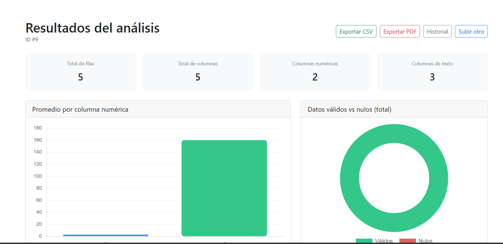
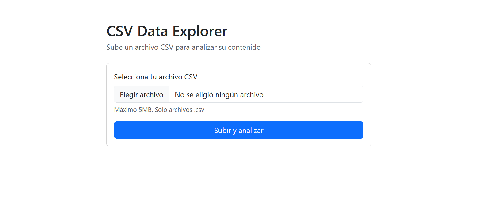
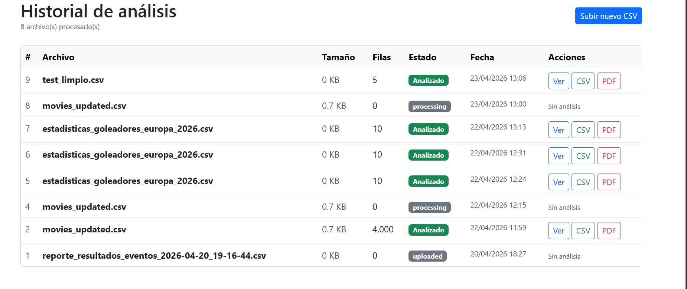

# CSV Data Explorer

Herramienta web para subir archivos CSV y obtener automáticamente 
estadísticas descriptivas y visualizaciones interactivas de los datos.



## Características

- Subida de archivos CSV con validación de formato y tamaño
- Análisis automático con estadísticas por columna: mínimo, máximo, 
  promedio, mediana y desviación estándar
- Detección automática de valores nulos vs válidos
- Visualización interactiva con gráfica de barras y gráfica de dona
- Historial completo de archivos analizados
- Exportación de resultados en CSV y PDF

## Stack tecnológico

| Capa | Tecnología |
|------|-----------|
| Backend web | PHP 8.2 + CodeIgniter 3 |
| API de análisis | Python 3 + Flask |
| Procesamiento de datos | Pandas |
| Base de datos | MySQL |
| Frontend | Bootstrap 5 + Chart.js |
| Generación de PDF | fpdf2 |

## Arquitectura

El proyecto usa una arquitectura de dos servicios que se comunican 
entre sí:

1. **App PHP (CI3)** — Maneja la subida de archivos, el historial 
   y las vistas
2. **API Flask (Python)** — Recibe la ruta del CSV, lo procesa con 
   Pandas y devuelve las estadísticas en JSON
[Navegador] → [CI3 / PHP] → [Flask API / Python + Pandas]
↕                      ↕
[MySQL]              [Archivo CSV]
## Capturas de pantalla

### Formulario de subida


### Resultados con gráficas


### Historial de análisis


## Instalación local

### Requisitos previos
- XAMPP (Apache + MySQL)
- Python 3.8 o superior
- Git

### Pasos

**1. Clonar el repositorio:**
```bash
git clone https://github.com/[TU_USUARIO]/csv-data-explorer.git
cd csv-data-explorer
```

**2. Configurar CodeIgniter:**
- Coloca la carpeta en `htdocs/` de XAMPP
- Edita `application/config/config.php` con tu `base_url`
- Edita `application/config/database.php` con tus credenciales

**3. Crear la base de datos:**
- Abre phpMyAdmin y crea una base de datos llamada `csv_explorer_db`
- Ejecuta el archivo `database/schema.sql`

**4. Configurar y correr Flask:**
```bash
cd flask-api
python -m venv venv
venv\Scripts\activate      # Windows
source venv/bin/activate   # Mac/Linux
pip install -r requirements.txt
python app.py
```

**5. Abrir la aplicación:**
http://localhost/csv-data-explorer/ 
Nota: Debes configurar en otro puerto en dado caso que ya tengas ese puerto ocupado, como me sucedio en mi caso
## Uso

1. Entra a la aplicación y haz clic en **Selecciona tu archivo CSV**
2. Elige cualquier archivo `.csv` de tu computadora (máximo 5MB)
3. Haz clic en **Subir y analizar**
4. Visualiza las estadísticas y gráficas generadas automáticamente
5. Descarga el reporte en **CSV** o **PDF** desde los botones del encabezado
6. Consulta el **Historial** para ver todos tus análisis anteriores

## Estructura del proyecto
csv-data-explorer/
├── application/
│   ├── controllers/
│   │   └── Upload.php          # Controlador principal
│   ├── models/
│   │   ├── Upload_model.php    # Modelo de archivos
│   │   └── Analysis_model.php  # Modelo de resultados
│   ├── views/
│   │   ├── upload_form.php     # Formulario de subida
│   │   ├── results.php         # Resultados y gráficas
│   │   └── history.php         # Historial de análisis
│   └── helpers/
│       └── flask_helper.php    # Helper para llamar a Flask
├── flask-api/
│   ├── app.py                  # API Flask con Pandas
│   └── requirements.txt        # Dependencias Python
├── database/
│   └── schema.sql              # Estructura de la base de datos
├── screenshots/                # Capturas del proyecto
└── uploads/                    # Archivos CSV subidos (ignorado en git)

## Autor

**[Carlos Enrique Nares Montaño]**  
Estudiante de Ingenieria en Sistemas Computacionales 
[LinkedIn](https://www.linkedin.com/in/carlos-enrique-nares-monta%C3%B1o-58b201298/) · 
[GitHub](https://github.com/Carlosnm0802)